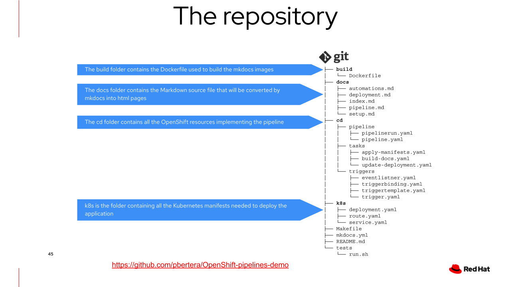

# OpenShift Pipelines Demo

This website hosts an OpenShift pipelines demo and is itself built with Pipelines.

This is a demo

## How this application works

This application is a static website built with [mkdocs](https://www.mkdocs.org/). The code of the demo is hosted on [GitHub](https://github.com/pbertera/OpenShift-pipelines-demo)

## Project Structure

The following image represents the project structure

- `build/` is a folder container the `Dockerfile` and the needed resourced to build the mkdocs image
- `cd/` this folder contains the tasks, pipeline and pipelinerun manifests definition
- `docs/` contains the Markdown documentations rendered by mkdocs
- `k8s/` contains all the needed manifest to deploy the application on Kubernetes
- `mkdocs.yml` the main mkdocs configuration file
- `Makefile` a Makefile do locally build the image and start a container for local development purpose
